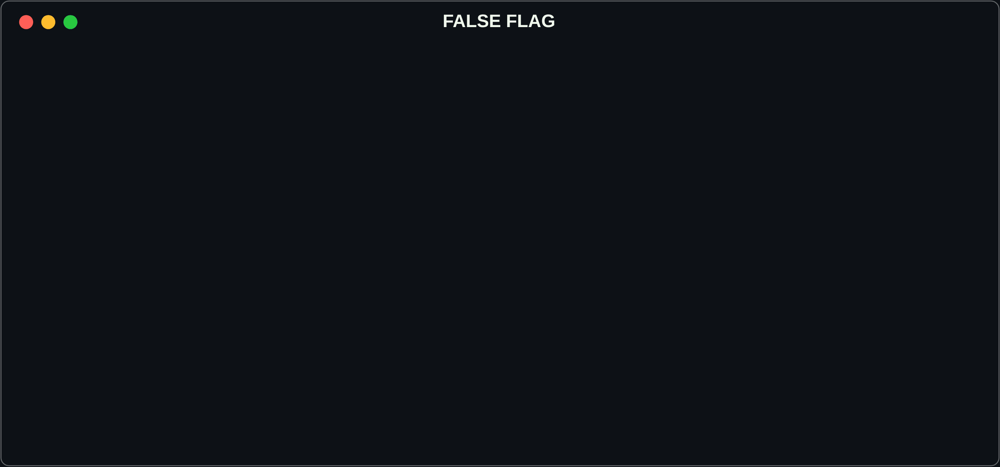
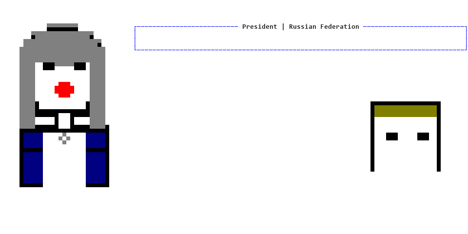

# FALSE FLAG: THE WARGAME

You are the UK Prime Minister. Russia has just staged an attack and blamed Britain for it. Your cabinet of AI advisors is waiting for you to decide what happens next — in your own words, not from a menu.

> Inspired by Sky News' **[The Wargame](https://www.audible.co.uk/podcast/The-Wargame/B0FCLQ7W9B)** podcast. This is an independent project — not affiliated with or endorsed by Sky News, Tortoise, or the podcast's participants.

**[Play it in your browser →](https://earlyprototype.github.io/false-flag/)** — the same engine, compiled to WebAssembly. You need a passphrase (or an OpenRouter key of your own); see [Sharing one key with playtesters](#sharing-one-key-with-playtesters-browser-build) below.



The whole game speaks one visual language — "Operation Tuman" fog, classification strips, and sonar traces, generated by a seeded ASCII aesthetic engine. See the [visual reference gallery](docs/media/README.md) and [docs/AESTHETIC_LANGUAGE.md](docs/AESTHETIC_LANGUAGE.md).



## What Happens in a Session

- **Briefing** — you're read into the crisis: intelligence updates, breaking developments, and sometimes a call from a foreign leader you have to take there and then.
- **Cabinet discussion** — you question five AI advisors (military, intelligence, diplomatic, legal, domestic) in plain English, and they answer in character.
- **Free-form decision** — you say, in your own words, what you want to do. There is no list to choose from.
- **Adjudication** — the game interprets your decision, your advisors push back if it's reckless, and the outcome plays out.
- **Consequences** — escalation risk, alliance cohesion, and domestic stability shift, the world state updates, and it carries into the next turn.
- Play this out across a live, unscripted crisis with seven nations in the mix, until the UK faces the threat down, stumbles into war, or looks weak in front of an adversary testing NATO's resolve.

Here's a full first turn, start to finish:


## Features

- **Free-form Decision Making**: Describe any action you want to take - the game interprets and adjudicates it
- **AI-Powered Advisors**: Ask questions and get intelligent responses from your Cabinet (CDS, NSA, Foreign Secretary, Home Secretary, Attorney General)
- **Dynamic Scenario Generation**: Events unfold based on your decisions and the evolving crisis
- **Realistic Constraints**: Limited military capabilities, alliance politics, legal frameworks, and public opinion
- **Two-Phase Turns**: Discussion phase (ask questions, gather advice) and Decision phase (commit to action)
- **Save/Load System**: Continue your campaign across multiple sessions

## Quickstart

**Windows (PowerShell):**

```powershell
git clone https://github.com/earlyprototype/false-flag.git
cd false-flag

python -m venv .venv
.\.venv\Scripts\pip.exe install -r requirements.txt

# Avoids a console-encoding crash some Windows terminals hit on the box-drawing UI
$env:PYTHONIOENCODING = "utf-8"

.\.venv\Scripts\python.exe -m cli.main play
```

**Linux / macOS:**

```bash
git clone https://github.com/earlyprototype/false-flag.git
cd false-flag

python3 -m venv .venv
.venv/bin/pip install -r requirements.txt

.venv/bin/python -m cli.main play
```

No API key and no config file needed. With nothing configured, the game defaults to a deterministic **mock** advisor mode, so you get the full turn structure — briefing, cabinet Q&A, decision, adjudication — without calling out to any LLM provider. On first launch you'll be asked to pick a scenario, play mode, difficulty, and game type; each menu has a sensible default, so pressing Enter through them is fine.

### Real AI advisors (recommended for actual play)

Mock mode proves the game runs (and each advisor now has their own canned voice), but it doesn't reason about your specific decision. For the real experience, point the game at any OpenAI-compatible LLM endpoint — hosted or local:

1. Copy the example config: `copy config.example.py config.py` (Windows) or `cp config.example.py config.py` (Linux / macOS)
2. Uncomment one preset block in `config.py` — **Groq** (free hosted, no card), **OpenRouter** (free `:free` models), or **Ollama** (free, runs locally, no key at all):
   ```python
   LLM_PROVIDER = "openai_compat"
   OPENAI_COMPAT_BASE_URL = "https://api.groq.com/openai/v1"
   OPENAI_COMPAT_API_KEY = "gsk_..."
   OPENAI_COMPAT_MODEL = "llama-3.3-70b-versatile"
   ```
3. Run the same launch command again.

See [docs/LLM_PROVIDERS.md](docs/LLM_PROVIDERS.md) for the full provider comparison (free-tier status as of Aug 2026), recommended models, and the Ollama local walkthrough. The original Google Gemini path still works ([docs/GEMINI_SETUP.md](docs/GEMINI_SETUP.md)), but its free tier is now heavily restricted.

## Sharing one key with playtesters (browser build)

`docs/` *is* the browser build — the same engine compiled to WebAssembly, served as a static site with nothing else on it. Getting in takes a key. **You can publish your own key, encrypted under a passphrase, and hand the passphrase to testers**; that is the way in the page leads with. A player who would rather spend their own money can paste an OpenRouter key instead.

There is no "play without a key" option. The deterministic offline driver still exists, but only as what the engine falls back to when a live call is refused mid-campaign — and when that happens the page says so, in words, rather than quietly serving canned advisors.

GitHub Pages has no server, so nothing shipped with the page can be a secret — a JavaScript password check is bypassed by opening the console, and a plaintext key in a public repo is a plaintext key forever. So the key is *encrypted*, the ciphertext is published, and the passphrase — which is never published — is the only thing that opens it.

### Generating the blob

1. Create a key at [openrouter.ai/settings/keys](https://openrouter.ai/settings/keys) that you use for nothing else, and **set a credit limit on it.** Everyone who unlocks the page spends from it. This is not optional; it is the only thing bounding your exposure.
2. Open `dev-scripts/encrypt-key.html` from disk (`file://`). It is a single self-contained page with no dependencies, no build step and a Content Security Policy that forbids every outbound request the browser can make. It is the only page in this project where *you* type the key in the clear, and it runs on your machine: it holds the key in one variable in one tab, encrypts it there, and writes it nowhere. (It is not the only code that ever holds the key in the clear — see below.)
3. Press **Generate a passphrase** and use what it gives you. The passphrase is the entire security of this scheme, so anything the page scores under 64 bits is refused.

   If you insist on a passphrase of your own that lands under the floor, the page will encrypt under it — but only after you tick a box, next to a plain statement of what it costs, for that specific passphrase. The tick is withdrawn the moment you edit the passphrase, so the consent is always for the thing actually in the box. Nothing else is weakened: the KDF stays at 600,000 iterations and the blob shape does not change. Understand what you are buying: the file is public and permanent, so a weak passphrase is guessed offline at whatever speed the attacker's hardware allows, and from that point the spend limit on the key is your only real control and revoking it is the only off-switch.
4. Paste the key, press **Encrypt**. The page decrypts what it just produced and checks it round-trips before offering it to you.
5. Save the output as `docs/shared-key.json` and commit it deliberately:

   ```bash
   git add -f docs/shared-key.json
   ```

   The `-f` is required and intended. The repo's `.gitignore` ignores `*.json` wholesale, so this file cannot be committed by accident — but it is not given an ignore rule of its own either, because you *do* need to be able to commit it. `docs/shared-key.example.json` is committed as a worked example of the format; it decrypts, with the passphrase `example-passphrase-not-a-secret-1234567890`, to the fake key `sk-or-v1-EXAMPLE-NOT-A-REAL-KEY`.

6. Send the passphrase to testers **out of band** — Signal, a phone call, anything that is not the repository, the issue tracker, a commit message or the page itself. A passphrase stored next to the ciphertext buys you nothing.

The play page fetches `shared-key.json` on load. If it is absent — which is what every fork will see — the passphrase panel is never offered at all, and the own-key path becomes the only way in.

### What the crypto is

PBKDF2-HMAC-SHA256 over a fresh 16-byte random salt, at least 600,000 iterations, deriving a 256-bit AES-GCM key; AES-256-GCM under a fresh 12-byte random IV. All `window.crypto.subtle`; no library, no invented scheme.

```json
{"v":1,"kdf":"PBKDF2-SHA256","iterations":600000,"salt":"<b64>","iv":"<b64>","ct":"<b64>"}
```

A wrong passphrase derives a different AES key and fails on the GCM authentication tag. There is no verifier field, no hint and no password check in the blob, so a wrong guess produces exactly one signal — failure — and the page says only *"that passphrase did not work"*. Attacking the blob therefore costs exactly what guessing the passphrase costs, times the iteration count.

Be exact about what unlocking costs. To make a call to OpenRouter at all, something has to hold the decrypted key: after a successful unlock, `docs/app.js` keeps it in a JavaScript variable (`ui.sharedKey`) and passes it to the worker, which puts it in an `Authorization` header. It is therefore in the tab's memory for as long as the tab is open, and anyone who can run code in that tab — a browser extension, a console paste, an XSS bug on the page — can read it. Encryption protects the key *in the repository*, from everyone without the passphrase; it cannot protect it from the tab that is using it.

What the play page does not do: it never writes the decrypted key to `localStorage` or `sessionStorage` or a cookie, never renders it into the DOM (not even masked, unlike your own key), and never logs it. There is deliberately no "remember it" for this path — remembering a key that is not yours defeats the point of locking it up. Closing the tab ends it.

### Revoking

**Revoke the key at OpenRouter. That is the off-switch.** Deleting `docs/shared-key.json` is housekeeping, not revocation: the file's contents stay in git history, in every clone and fork, and on anyone's disk who ever loaded the page. Assume that once you commit the blob it is public forever, and that anyone who ever had the passphrase — including anyone a tester passed it on to — can recover the key from it at any point in the future.

So, to actually stop it:

1. Delete the key at [openrouter.ai/settings/keys](https://openrouter.ai/settings/keys). The published ciphertext is now worthless.
2. Delete `docs/shared-key.json` and push, so the option stops appearing.
3. If you still want shared play: issue a *new* key, cap it, and generate a *new* blob with a *new* passphrase. Never reuse the old passphrase — the old blob is still out there and still opens under it.

### Verifying it

Needs Playwright and a Chromium binary (`playwright` is in `requirements-dev.txt`; the browser is a separate download):

```bash
pip install -r requirements-dev.txt
python -m playwright install chromium     # once; ~150 MB
python dev-scripts/verify_shared_key.py
```

If Chromium already lives somewhere else, point the script at it instead of downloading another copy — `PLAYWRIGHT_BROWSERS_PATH` (it looks for `chromium-*/chrome-linux/chrome` or `chromium-*/chrome-linux64/chrome` underneath, and defaults to `/opt/pw-browsers`), or `FF_CHROMIUM` for an exact executable:

```bash
PLAYWRIGHT_BROWSERS_PATH=/opt/pw-browsers .venv/bin/python dev-scripts/verify_shared_key.py
```

Drives the encryptor from `file://` with a dummy key, serves the resulting blob to an unmodified play page, plays a turn against a local stand-in for `openrouter.ai`, and asserts that the `Authorization` header carried exactly that dummy key — then dumps `localStorage`, `sessionStorage`, cookies and the whole serialised DOM and asserts the key is in none of them. It also checks that:

- a wrong passphrase fails cleanly, with one uninformative sentence;
- the stand-in endpoint answering **401** and then **429** mid-campaign makes the page say so in plain words — not hang, not fail silently, and not quietly serve canned advisors as if nothing had happened;
- there is no "play without a key" control anywhere, and no campaign starts without a key;
- with no blob present the passphrase panel vanishes and the own-key path — now the only way in on a fork — still plays a real turn with the right key in the header;
- the encryptor still refuses a sub-64-bit passphrase, and the override that allows one is off by default, needs a deliberate tick, and is withdrawn by any edit to the passphrase.

The script never writes `docs/shared-key.json`: the blob it makes is held in memory and served from there, and if your own blob is sitting in the working tree the script's server answers from memory instead of ever opening it.

## How to Play

### Commands

During gameplay, you can use:

- **Ask Questions**: `CDS, what are our military options?`
- **Get Advice**: `NSA, what's Russia's likely next move?`
- **Check Status**: `/status` - View metrics and situation
- **View Menu**: `/menu` - See available advisors and commands
- **Intelligence**: `/intel` - Briefing on foreign actors
- **Diplomacy**: `/call <country>` - Phone a foreign leader
- **Make Decision**: `/decide` - Commit to your action
- **Save Game**: `/save` - Save progress
- **Quit**: `/quit` - Exit game

### Example Gameplay

```
> CDS, what are our air defence capabilities?

Military Commander: Prime Minister, we can maintain only two simultaneous 
combat air patrols across the entire UK. Our Type-45 destroyers provide 
ballistic missile defence, but we have limited coverage...

> Foreign Secretary, will NATO support us?

Diplomatic Lead: Prime Minister, the US commitment is uncertain. We must 
activate Article 4 consultations immediately and engage directly with 
Washington to secure their backing...

> /decide

Prime Minister, what is your decision?
> Deploy Type-45 destroyers to defensive positions and request emergency 
  NATO consultations under Article 4

[Decision interpreted and adjudicated...]
```

## Game Mechanics

### Metrics

Your decisions affect three key metrics (visible as numbers in Classic mode,
as narrative "vibes" in Immersive/Emergent modes), plus a casualty count:

- **Escalation Risk** (0-100): Danger of conflict escalation
- **Domestic Stability** (0-100): Public confidence and infrastructure security
- **Alliance Cohesion** (0-100): NATO unity and US commitment

In **Classic mode**, the crisis has win/lose thresholds: escalation hitting 100,
stability or cohesion collapsing to 0 ends the campaign, and surviving to the
end of the scenario produces a graded resolution. Immersive and Emergent modes
are open-ended by design — the story continues as long as you keep playing.

### Advisor Pushback

Your advisors will warn you if actions are:
- Militarily implausible (deploying unavailable assets)
- Legally problematic (violating international law)
- Diplomatically risky (fracturing NATO)
- Domestically dangerous (causing panic)

### Constraints

You must balance:
- Limited military capabilities (only 2 air patrols for entire UK)
- Uncertain US/NATO commitment
- Legal frameworks (international law, rules of engagement)
- Public messaging and domestic security
- Russian provocations and false flag operations

## Project Structure

```
false-flag/
├── cli/                    # Command-line interface (the playable game)
├── engine/                 # Core game engine
│   ├── sim_loop.py        # Turn-based game loop
│   ├── initial_conditions.py  # Scenario setup
│   └── persistence.py     # Save/load system
├── llm/                    # LLM integration
│   ├── router.py          # Provider selection
│   ├── gemini_driver.py   # Google Gemini integration
│   ├── mock_driver.py     # Testing/offline mode
│   └── prompts.py         # Prompt templates
├── agents/                 # Advisor system
│   └── conversation.py    # Question handling & responses
├── models/                 # Data models (game state)
├── data/scenarios/         # Scenario data (initial conditions + turn injects)
├── Game_Mechanics/         # Design notes for the game systems
├── tests/                  # Test suite
├── docs/                   # The browser build (GitHub Pages root) + setup guides
├── scripts/                # Launchers and setup helpers
├── dev-scripts/            # Debugging and content-generation tools
├── api/, frontend/         # Experimental web UI — not wired into the CLI game yet
├── Graphics/, UX/          # Visual asset generation & UX exploration (experimental)
└── ingestion/, overrides/  # Scenario-content tooling
```

## Development

### Run Tests

```powershell
.\.venv\Scripts\python.exe -m pytest tests/
```

### Run Linter

```powershell
.\.venv\Scripts\python.exe -m ruff check .
```

## Further Documentation

- **[GAME_DESCRIPTION.md](GAME_DESCRIPTION.md)**: Full premise, characters, and the world behind the crisis
- **[Inspiration & Sources](docs/INSPIRATION.md)**: Full credit to The Wargame, Perun's NATO wargame analysis, and the wargaming research behind the design
- **[Diplomatic System](docs/handover/DIPLOMATIC_SYSTEM.md)**: How alliance negotiation and diplomatic encounters work
- **[Nuclear Command Chain](docs/handover/NUCLEAR_COMMAND_CHAIN_SYSTEM.md)**: Nuclear authority, consequences, and escalation control
- **[Dynamic Narrative System](docs/handover/DYNAMIC_NARRATIVE_SYSTEM.md)**: The hidden-narrative engine driving emergent storytelling

## Credits

See [docs/INSPIRATION.md](docs/INSPIRATION.md) for full credit to The Wargame (Sky News and Tortoise), Perun's NATO wargame analysis, and the wargaming research behind this design.

## Licence

MIT — see [LICENSE](LICENSE).

---

**Ready to face the crisis? The nation is waiting for your decision.** 🇬🇧

