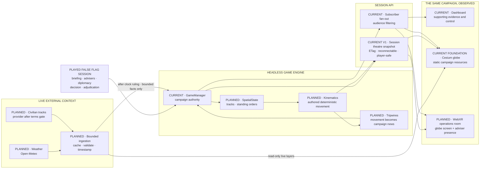
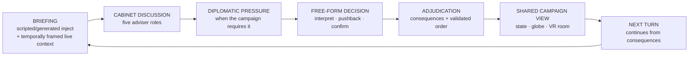
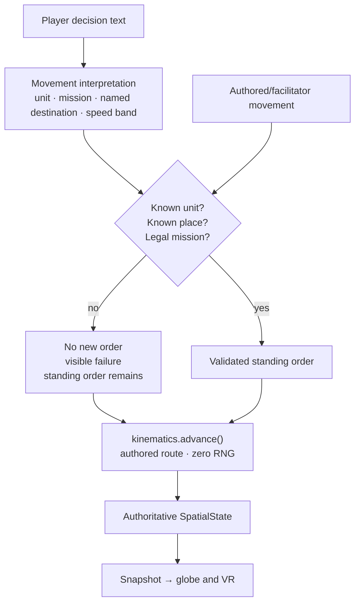
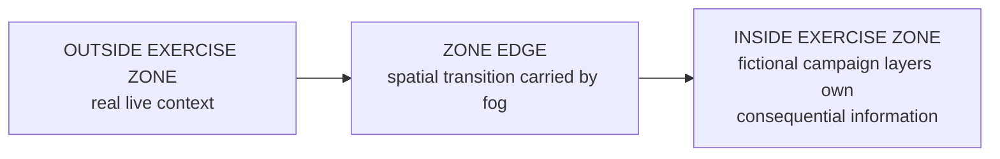
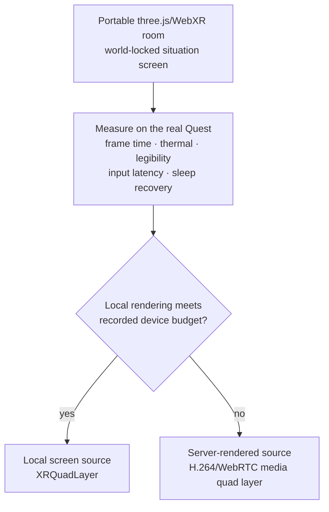
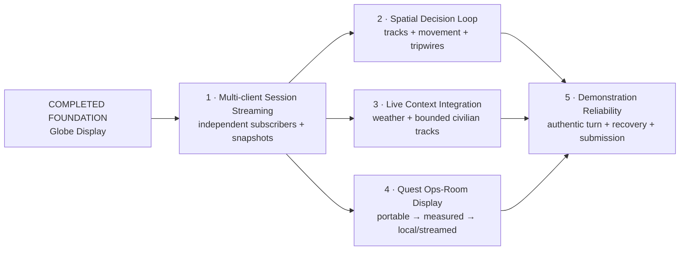

# Situation Globe and VR Operations Room — Component Map

This is the visual companion to [`PLAN.md`](../PLAN.md). The plan owns sequence
and status; this file shows the target data relationships. Labels in the first
diagram distinguish what exists from what the build adds.

## 1 · One game, several surfaces

The engine owns campaign state. External feeds and displays do not write it.
Live facts may enter bounded adviser context under
[issue #77](https://github.com/earlyprototype/false-flag/issues/77), but never
write metrics, positions, orders or outcomes.

## 2 · One authentic turn

This loop—not the dashboard by itself—is the product acceptance path.

## 3 · How a campaign position is written

Only gazetteer hydration and deterministic kinematics write coordinates. The
model never does. Source: settled movement design in
[issue #71](https://github.com/earlyprototype/false-flag/issues/71).

## 4 · Live/fictional boundary

The player surface does not explain this boundary with crude per-layer labels.
Spectator and recording surfaces use diegetic `EXERCISE` marking. Provider,
freshness and availability remain inspectable in the after-action record.

## 5 · VR screen build order

The measurement chooses where the screen pixels are produced; the room, game
session and input contract stay the same. Technical basis:
[WebXR Layers specification](https://immersive-web.github.io/layers/).

## 6 · Build slices

Slice 1 is the common dependency. Spatial, live-data and VR work can then
advance independently before they meet in the authentic-turn demonstration.
Reliability work runs throughout, not as a late hardening phase. No
agent-assigned duration or cut ladder is authoritative.

## References

- [Canonical plan](../PLAN.md)
- [Current build state](BUILD_STATE.md)
- [Full feasibility evidence](XR_GLOBE_FEASIBILITY.md)
- [Owner live-hybrid ruling](https://github.com/earlyprototype/false-flag/issues/77)
- [God's Eye View source at analysed commit](https://github.com/bilawalsidhu/gods-eye-view/tree/314a0e1)
- [God's Eye View data-source register at the analysed commit](https://github.com/bilawalsidhu/gods-eye-view/blob/314a0e1/DATA_SOURCES.md)
