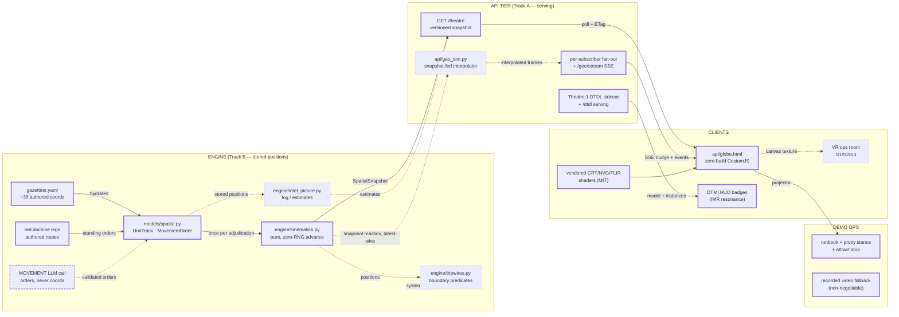
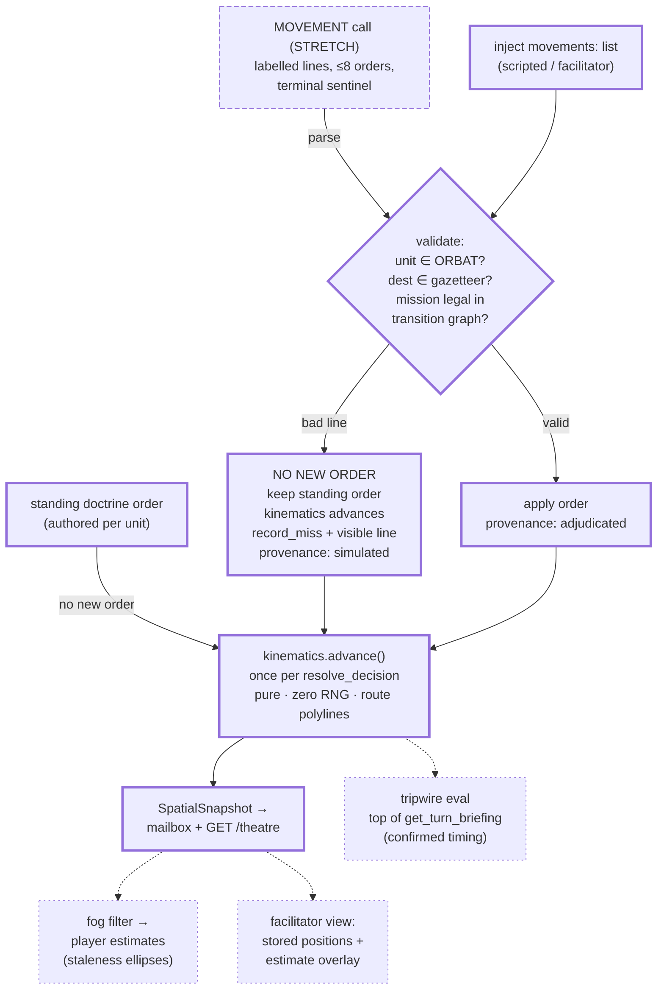
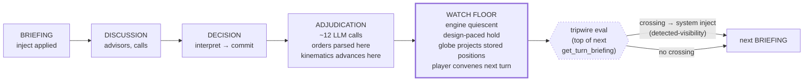
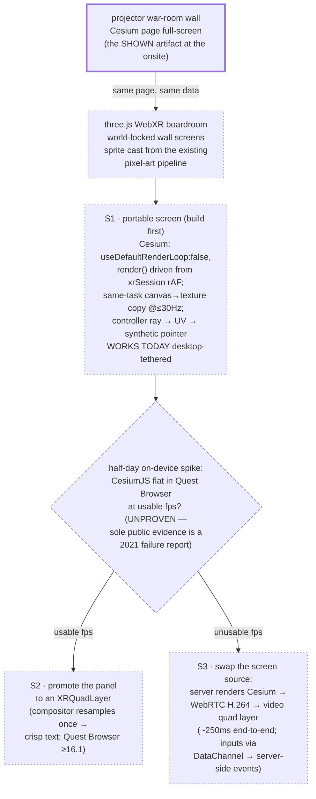

# Situation Globe — Component Map

> **New here?** This is an engineering-fidelity document — dense on purpose, written for whoever builds and maintains this so nothing is lost between sessions. For the plain-language version, start with [`XR_GLOBE_FEASIBILITY_IN_BRIEF.md`](XR_GLOBE_FEASIBILITY_IN_BRIEF.md); the plan is [`PLAN.md`](../PLAN.md), the explanation is [the Owner's Brief](OWNERS_BRIEF.md), and the current calls and defaults are in [`DECISION_BRIEFS.md`](DECISION_BRIEFS.md).

**Visual companion to [`XR_GLOBE_FEASIBILITY.md`](XR_GLOBE_FEASIBILITY.md).** Every box below is classified: **CORE** (solid, in the sprint), **STRETCH** (attempt only behind its decision gate), or **DEFERRED** (Afterwards tier — design verified and waiting; no schedule ruled). Links under each diagram go to the study section or file that specifies the component. Milestones and decision points are in the last diagram.

---

## 1 · System overview — what talks to what

**Legend**: thick border = CORE (sprint) · long dashes = STRETCH (gated) · short dashes = DEFERRED (Afterwards tier). Dotted arrows are paths that exist only once their source component ships.

| Component | Class | Specified in | Anchors |
|---|---|---|---|
| `models/spatial.py`, `engine/kinematics.py`, gazetteer, doctrine legs | CORE | [Study §4a](XR_GLOBE_FEASIBILITY.md#4a-track-b--the-authoritative-spatial-layer) | claims 9, 12 |
| Fan-out + `/geo/stream`, `GET /theatre` | CORE | [Study §4](XR_GLOBE_FEASIBILITY.md#4-track-a--presentation-architecture) | claim 5 |
| `globe.html`, shaders, watermark | CORE | [Study §4](XR_GLOBE_FEASIBILITY.md#4-track-a--presentation-architecture) | claims 2–4 |
| `Theatre;1` sidecar + DTMI badges | CORE (promoted — IMR venue) | [Study §4](XR_GLOBE_FEASIBILITY.md#4-track-a--presentation-architecture), gate 1 | claim 6 |
| Runbook + video fallback | CORE | [Study §5 gates 4–5, §7](XR_GLOBE_FEASIBILITY.md#5-gates) | — |
| MOVEMENT call | STRETCH (gate D2) | [Study §4a](XR_GLOBE_FEASIBILITY.md#4a-track-b--the-authoritative-spatial-layer) | claim 8 |
| Tripwires, fog, snapshot-fed daemon, VR ops room | DEFERRED | [Study §4a, §6](XR_GLOBE_FEASIBILITY.md#6-vr-the-ops-room) | claims 10, 11 |

---

## 2 · Track B mechanism — how a position gets written, and why no failure path can write an invented one

The safety property is structural: initial coordinates come only from the authored gazetteer at hydration, and every subsequent *movement* coordinate is produced only by `kinematics.advance()` from validated enums — no LLM output ever becomes a coordinate by either path. Clean parses apply; partial parses apply valid lines and visibly skip bad lines; empty, truncated, or failed calls issue zero new orders, every unit continues its last validated standing order, and kinematics advances. No call failure can freeze or invent a position ([study §4a](XR_GLOBE_FEASIBILITY.md#4a-track-b--the-authoritative-spatial-layer), claim 8 conditions).

---

## 3 · The turn, the watch floor, and the one legal tripwire instant

The watch floor is a designed phase, not latency filler — the engine waits indefinitely for the next `POST /briefing` ([study §2.1](XR_GLOBE_FEASIBILITY.md#2-three-findings-restated-under-the-new-framing)). Tripwires fire at exactly one instant, where positions are final and the same turn's inject generator sees the crossing (claim 10, confirmed).

---

## 4 · VR ops room — build order, drawn assuming a Quest headset is available

*(Assumption recorded 2026-08-28: drawn as if [issue #75](https://github.com/earlyprototype/false-flag/issues/75) — "is a Meta Quest VR headset available?" — answers **yes**. The issue stays open until the owner confirms; if it answers no, everything through S1 still ships for desktop-tethered headsets and demo capture — only the on-device Quest steps park.)*

Mechanics the tree encodes: the boardroom and S1 screen are one build (the room renders; the screen is a texture fed by Cesium's canvas under the two hard conditions of study claim 11); the spike is a measurement, not a design choice — its result selects *where the pixels are made* (on the headset → S2, on the server → S3) and nothing else changes, because the room, the cast, the input path, and the data contract are identical in both outcomes.

## 5 · Milestones — build contents and exit tests

*This diagram is a picture of the plan, not the plan itself. The plan — with per-stage status, build checklists and done tests — is **[`PLAN.md`](../PLAN.md)** at the repository root; update it there, redraw here. Node line 1 = what gets built; node line 2 (EXIT) = the observable fact that ends the stage.*

```mermaid
flowchart TD
  D0B{"D0b · GO GIVEN 30 AUG\nowner authorized Stage 1"}:::gate
  M0["M0 · GLOBE DISPLAY · BUILT IN PR #95\napi/globe.html at GET /globe (FileResponse) · CesiumJS ·\n14 gazetteer entries · plot GET /game/{id}/resources ·\nattach 1 stream consumer · 1 sensor shader ·\ndiegetic EXERCISE chrome\nDONE-TEST PASSED 31 AUG: every ORBAT unit plotted at its\nnamed location on the projector; state_update changed display"]:::core
  M1["M1 · SPATIAL STATE AND KINEMATICS · ~1 wk\nBUILD: models/spatial.py · gazetteer.yaml (~30 sourced) ·\nengine/kinematics.py (pure advance, route polylines, no RNG) ·\nhydration at init+load · red doctrine legs · snapshot at\nresolve_decision · save 2.4→2.5 + bundle rebuild · tests\nEXIT: red group advances each turn along its route;\nsave@turn3 → load → positions identical; full suite passes"]:::core
  D1{"D1 · schedule check\non schedule → M2\nbehind → skip to M3"}:::gate
  M2["M2 · THEATRE API AND MULTI-CLIENT STREAMING · ~1 wk\nBUILD: Theatre;1 + TheatreAsset;1 sidecar files (published\nversions untouched) · DTDLParser re-run committed ·\nGET /theatre (ETag) · per-subscriber bus fan-out with\nper-subscriber payload copies · DTMI badges bound to /dtdl\nEXIT: two clients on one session each receive every event;\nparser reports PARSE OK; badges live over the moving map"]:::core
  M3["M3 · DEMO OPERATIONS AND RELIABILITY · ~3–4 days · non-negotiable\nBUILD (hardens the live path — not a simulated retreat):\nwritten start sequence · restart drill under 60s · localhost\nbind + authenticated proxy · 2 timed projector rehearsals ·\nbooth-loop config chosen at rehearsal as a labeled decision ·\nfilm recorded from a real run (hardware contingency only)\nEXIT: one rehearsal executed to the written sequence with\nzero operator improvisation; the film file exists"]:::core
  D2{"D2 · schedule gate only\nM3 done AND ≥3 clear days?\n(design already decided —\nissue #71 closed: orders on)"}:::gate
  M4["M4 · VALIDATED MOVEMENT ORDERS · ~1 wk\nBUILD: MOVEMENT call family (derived crc32 seed) · parser\n(≤8 orders, terminal sentinel, discard on truncation) ·\nvalidation vs unit registry + gazetteer + legality graph ·\nhold-on-failure + visible line · mock returns NO_ORDERS ·\ninject movements: · spatial context block · one re-baseline\nEXIT: a decision naming a movement lands in order_log and\nmoves the unit next turn; garbled reply → 0 orders + note"]:::stretch
  ONSITE(["ONSITE · 12 Sep · IMR"]):::core
  FINAL(["FINAL · 14 Sep"]):::core
  M5["M5 · AFTERWARDS (each independently buildable)\ntripwire engine · fog/intel_picture · snapshot-fed daemon\n+ /geo/stream · live-hybrid mode (#77) · email artifact (#76)\n· VR ops room (§4 build order)"]:::defer

  D0B --> M0 --> M1 --> D1
  D1 -->|on schedule| M2 --> M3
  D1 -->|behind| M3
  M3 --> D2
  D2 -->|yes| M4 --> ONSITE
  D2 -->|no · M4 moves to M5| ONSITE
  ONSITE --> FINAL --> M5

  classDef core stroke-width:3px
  classDef stretch stroke-dasharray:6 3
  classDef defer stroke-dasharray:2 4
  classDef gate stroke-width:2px
```

Every stage ships runnable on its own; under schedule pressure the cut order is M5 → M4 → M2. The gates are schedule instruments, not design questions: **D1** protects M3 (standards chrome is droppable, a rehearsed demo is not), and **D2** only asks whether M4 fits before the onsite — its design decision was settled and closed in [issue #71](https://github.com/earlyprototype/false-flag/issues/71).

Parallel throughout, off-branch: the Manus research queue — see [issue #70](https://github.com/earlyprototype/false-flag/issues/70) (credits durable; ordering build-dependency-driven, gazetteer verification feeding M1).
