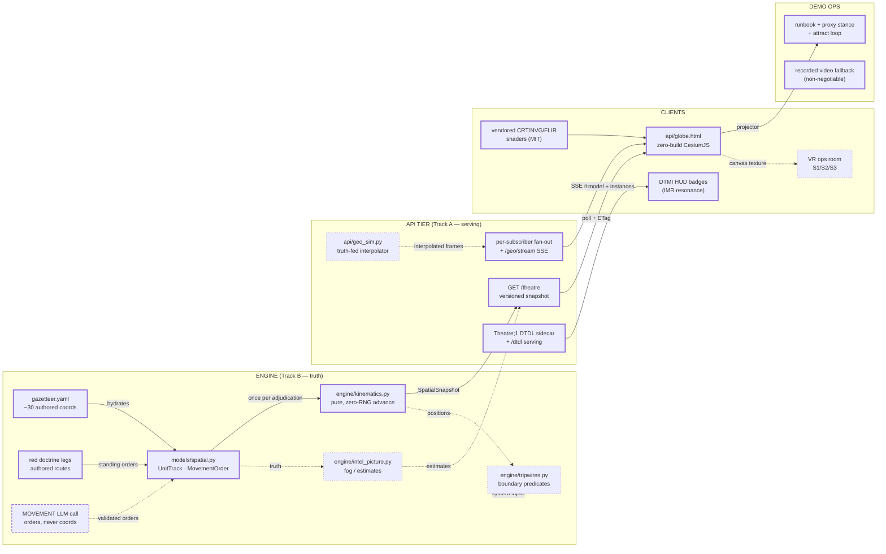
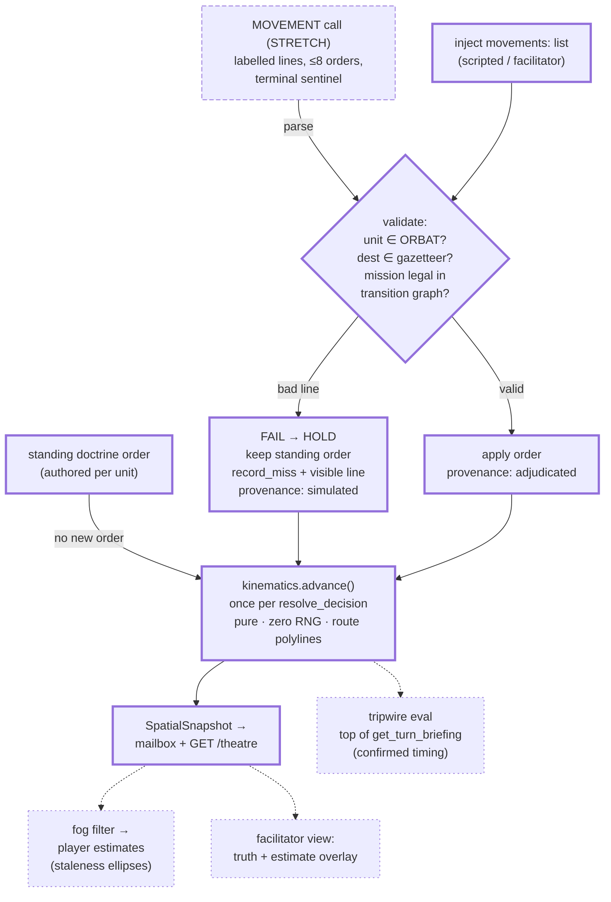
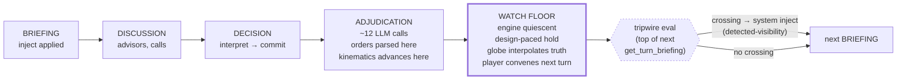
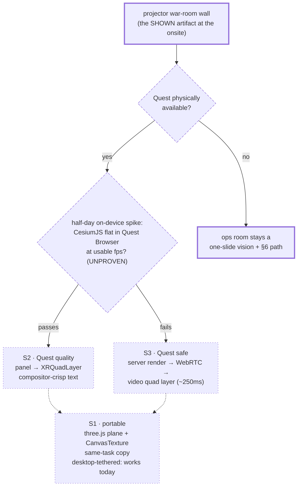
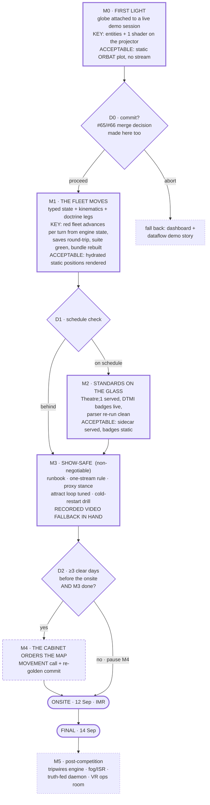

# Situation Globe — Component Map

**Visual companion to [`XR_GLOBE_FEASIBILITY.md`](XR_GLOBE_FEASIBILITY.md).** Every box below is classified: **CORE** (solid, in the competition sprint), **STRETCH** (attempt only behind its decision gate), or **DEFERRED** (post-competition, design verified and waiting). Links under each diagram go to the study section or file that specifies the component. Milestones and decision points are in the last diagram.

---

## 1 · System overview — what talks to what

**Legend**: thick border = CORE (sprint) · long dashes = STRETCH (gated) · short dashes = DEFERRED (post-competition). Dotted arrows are paths that exist only once their source component ships.

| Component | Class | Specified in | Anchors |
|---|---|---|---|
| `models/spatial.py`, `engine/kinematics.py`, gazetteer, doctrine legs | CORE | [Study §4a](XR_GLOBE_FEASIBILITY.md#4a-track-b--the-authoritative-spatial-layer) | claims 9, 12 |
| Fan-out + `/geo/stream`, `GET /theatre` | CORE | [Study §4](XR_GLOBE_FEASIBILITY.md#4-track-a--presentation-architecture) | claim 5 |
| `globe.html`, shaders, watermark | CORE | [Study §4](XR_GLOBE_FEASIBILITY.md#4-track-a--presentation-architecture) | claims 2–4 |
| `Theatre;1` sidecar + DTMI badges | CORE (promoted — IMR venue) | [Study §4](XR_GLOBE_FEASIBILITY.md#4-track-a--presentation-architecture), gate 1 | claim 6 |
| Runbook + video fallback | CORE | [Study §5 gates 4–5, §7](XR_GLOBE_FEASIBILITY.md#5-gates) | — |
| MOVEMENT call | STRETCH (gate D2) | [Study §4a](XR_GLOBE_FEASIBILITY.md#4a-track-b--the-authoritative-spatial-layer) | claim 8 |
| Tripwires, fog, truth-fed daemon, VR ops room | DEFERRED | [Study §4a, §6](XR_GLOBE_FEASIBILITY.md#6-vr-the-ops-room) | claims 10, 11 |

---

## 2 · Track B mechanism — how a position becomes truth (and why it can't lie)

The safety property is structural: coordinates are only ever produced by `kinematics.advance()` from validated enums — every failure path converges on HOLD, so *a stale position beats a false move, always* ([study §4a](XR_GLOBE_FEASIBILITY.md#4a-track-b--the-authoritative-spatial-layer), claim 8 conditions).

---

## 3 · The turn, the watch floor, and the one legal tripwire instant

The watch floor is a designed phase, not latency filler — the engine waits indefinitely for the next `POST /briefing` ([study §2.1](XR_GLOBE_FEASIBILITY.md#2-three-findings-restated-under-the-new-framing)). Tripwires fire at exactly one instant, where positions are final and the same turn's inject generator sees the crossing (claim 10, confirmed).

---

## 4 · VR shapes — one decision tree

Both hard conditions apply to every local shape: Cesium driven from `xrSession.requestAnimationFrame`, and the canvas copy in the same JS task as the render ([study §6](XR_GLOBE_FEASIBILITY.md#6-vr-the-ops-room), claim 11).

---

## 5 · Milestones and decision points (replaces day-counting)

Reading the gates: **D0** is the only abort point — after it, every later decision only *re-orders or pauses* work, never wastes it. **D1** protects M3: standards chrome is droppable, a safe demo is not. **D2** is the LLM-overestimation hedge you asked for — if the timeline estimates were pessimistic and M3 lands early, M4 is pre-authorized; if not, it pauses cleanly to M5 (the design is verified and waiting either way).

Parallel at all times, off-branch: the **Manus queue** — see [`MANUS_TASKS.md`](MANUS_TASKS.md) (credits are durable; ordering is build-dependency-driven).
